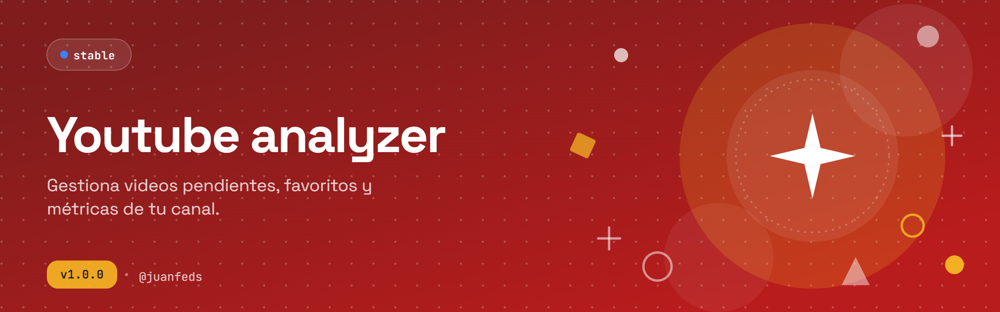

# Viewlytics

<p align="center">
  
</p>

<p align="center">
  
  
  
  
  
  
</p>

Viewlytics es una aplicación web personal para organizar el consumo de YouTube. Centraliza suscripciones, videos pendientes, favoritos y estadísticas en una sola interfaz, sin depender de las listas nativas de YouTube. Incluye reproductor embebido con cola de reproducción, auto-play y filtro de Shorts.

---

## 📋 Tabla de Contenidos

1. [✨ Funcionalidades](#1--funcionalidades)
2. [🏛️ Arquitectura](#2-️-arquitectura)
3. [🗄️ Modelo de Datos](#3-️-modelo-de-datos)
4. [⚙️ Guía de Uso](#4-️-guía-de-uso)
5. [📬 Contacto](#5--contacto)

---

## 1. ✨ Funcionalidades

| Sección | Descripción |
|---------|-------------|
| 🔐 **Autenticación** | Google OAuth vía Supabase Auth. Sesión persistente con refresh automático |
| 📺 **Suscripciones** | Lista de canales suscritos desde YouTube con búsqueda, filtro por categoría y drawer de detalle |
| 🏷️ **Categorías** | Crea categorías personalizadas y asigna canales para organizar el feed |
| ⏳ **Pendientes** | Guarda videos para ver después. Marca como visto y filtra por estado |
| ⭐ **Favoritos** | Colección personal de videos destacados |
| 🔍 **Búsqueda** | Busca videos directamente en YouTube desde la app |
| 🎬 **Reproductor** | Player embebido con cola de reproducción, auto-play al terminar (countdown de 5s) y filtro de Shorts |
| 📊 **Estadísticas** | Dashboard con visualizaciones ECharts sobre historial y tendencias de consumo |
| 🌙 **Tema** | Selector dark/light persistente |

---

## 2. 🏛️ Arquitectura

```
viewlytics/
├── client/                  # SPA React — desplegada en GitHub Pages
│   └── src/
│       ├── pages/           # Subscriptions, Playlists, Pending, Search, Favorites, Stats
│       ├── components/      # VideoPlayerModal, ChannelDrawer, AppSidebar, shadcn/ui
│       ├── hooks/           # useAuth, useSavedIds, useTheme
│       └── lib/             # api.js (axios + Supabase token), youtube.js (YouTube API utils)
├── supabase/
│   └── functions/           # Edge Functions (Deno) — API backend serverless
└── docs/
    └── database-schema.md   # Esquema de BD documentado
```

**Flujo de datos:**

```
Browser → Supabase Edge Functions (auth + DB) → PostgreSQL (Supabase)
Browser → YouTube Data API v3 (búsqueda, metadatos, channel videos)
Browser → YouTube IFrame API (reproductor embebido)
```

- **Frontend**: React 19 SPA con shadcn/ui + Tailwind CSS v4, desplegada en GitHub Pages vía GitHub Actions.
- **Backend**: Supabase Edge Functions (Deno/TypeScript) expuestas en `/functions/v1/*`. No hay servidor propio.
- **Auth**: Supabase Auth con proveedor Google OAuth 2.0. El token de acceso a YouTube se almacena en la tabla `profiles` para hacer llamadas autorizadas desde Edge Functions.
- **YouTube API**: Las llamadas a `search.list` y `videos.list` se hacen directamente desde el browser (cuota: 10,000 unidades/día).

---

## 3. 🗄️ Modelo de Datos

PostgreSQL gestionado por Supabase con Row Level Security en todas las tablas de usuario.

| Tabla | Rol |
|-------|-----|
| `profiles` | Datos del usuario y tokens OAuth de Google |
| `channels` | Metadatos de canales de YouTube (referencia) |
| `videos` | Metadatos centralizados de videos |
| `subscription_categories` | Categorías personalizadas del usuario |
| `subscription_category_map` | Relación N:M suscripción ↔ categoría |
| `pending_videos` | Videos guardados para ver después (`watched_at` = NULL si pendiente) |
| `favorite_videos` | Videos marcados como favoritos |
| `user_events` | Log de eventos para análisis (`video_saved`, `video_watched`, etc.) |
| `daily_snapshots` | Snapshot diario por usuario para tendencias temporales |

---

## 4. ⚙️ Guía de Uso

### Requisitos

- Node.js 18+
- Cuenta en [Supabase](https://supabase.com) con proyecto configurado
- API Key de [YouTube Data API v3](https://console.cloud.google.com)
- Google OAuth 2.0 configurado como proveedor en Supabase Auth

### Instalación

```bash
git clone https://github.com/JuanFeDS/viewlytics.git
cd viewlytics/client
npm install
```

### Variables de entorno

Crea `client/.env.local`:

```env
VITE_SUPABASE_URL=https://<tu-proyecto>.supabase.co
VITE_SUPABASE_ANON_KEY=<anon-key>
VITE_YOUTUBE_API_KEY=<youtube-api-key>
```

Las Edge Functions leen sus secretos desde **Supabase Dashboard → Settings → Edge Functions → Secrets**:

| Secret | Descripción |
|--------|-------------|
| `GOOGLE_CLIENT_ID` | Cliente OAuth de Google |
| `GOOGLE_CLIENT_SECRET` | Secret del cliente OAuth |

### Desarrollo

```bash
cd client
npm run dev        # Inicia Vite en localhost:5173
```

### Build y deploy

```bash
npm run build      # Genera client/dist/
```

El deploy a GitHub Pages se ejecuta automáticamente al hacer push a `main` vía GitHub Actions (`.github/workflows/deploy-client.yml`). Requiere los secrets `VITE_SUPABASE_URL`, `VITE_SUPABASE_ANON_KEY` y `VITE_YOUTUBE_API_KEY` configurados en el repositorio.

Para desplegar Edge Functions:

```bash
npx supabase functions deploy <nombre-de-la-funcion>
```

### ⚠️ Limitaciones conocidas

- **Cuota YouTube API**: `search.list` consume 100 unidades por búsqueda (límite: 10,000/día). Sin caché implementado.
- **Google OAuth en modo Testing**: Máximo 100 usuarios de prueba registrados manualmente. Requiere verificación de Google para uso público.

---

## 5. 📬 Contacto

JuanFe — [jmartinezbernal02@gmail.com](mailto:jmartinezbernal02@gmail.com)
